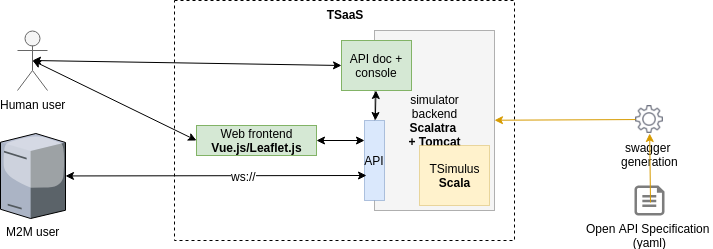
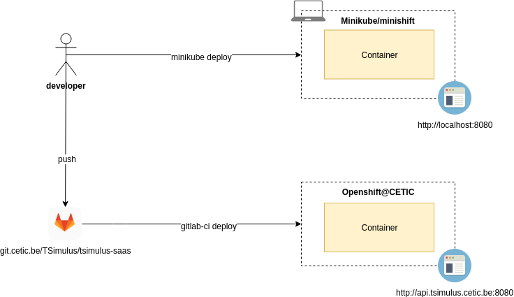

# TSimulus As A Service : TSAAS

[](https://git.cetic.be/TSimulus/tsimulus-saas/commits/develop)

This repository is a rework of https://git.cetic.be/TSimulus/tsimulus-cluster

## Goal

In progress: this README.md need to be refactored! (draw + architecture definition)

This project contains the high level documentation for the TSimulus SaaS project.
The aim of this work is to provide a self service that showcases TSimulus capabilities.

The project aims at building a REST API in front of the [TSimulus](https://github.com/cetic/TSimulus) framework.

After, the project will aim at building a play frontend. The frontend will provide

* A job-execute frontend to generate timeseries with the [TSimulus](https://github.com/cetic/TSimulus) framework.

## 0. Getting Started

Clone this repository

```
git clone git@git.cetic.be:TSimulus/tsimulus-cluster.git
```

### 0.1. Prerequisites

Install [Vagrant](https://www.vagrantup.com/) and [Virtualbox](https://www.virtualbox.org/)

### 0.2. Local development development

Launch the VM and ssh into it: 

```bash
vagrant up
vagrant ssh
```

Go into your shared `/vagrant` folder.

To run the akka cluster on a single local instance, you need to update the variable seed-nodes in the two application.conf files (in `backend/src/main/resources/application.conf` and in `frontend/src/main/resources/application.conf`).

Then, run each line in a new terminal. 

```
sbt "backend/run 2551"
sbt "backend/run 2552"
sbt "project frontend" run
```

Go to [localhost:9000](http://localhost:9000) and enjoy the frontend.

The `/vagrant` folder in the VM is shared with the folder where the `Vagrantfile` is on the host computer. 

### 0.3. Local development development with Minikube

#### 0.3.1. Install Minikube

* Install VirtualBox: https://www.virtualbox.org/wiki/Downloads
* Install Kubectl: https://kubernetes.io/docs/tasks/tools/install-kubectl/
* Install Minikube: https://github.com/kubernetes/minikube/releases

#### 0.3.2. Deploy the project

To get the Kubernetes dashboard, type: `minikube dashboard` 

```
kubectl create -f tsimulus-backend-statefulset.yml
```

## 1. Functional specifications

### 1.1. TSimulus as a service

Definition of TSimulus from the documentation: https://tsimulus.readthedocs.io/en/latest/

TSimulus is a toolkit for generating random, yet realistic, time series. In this project, a time series is nothing but a orderly sequence of points in times, each of them being associated to at most a value. Time series are used in a wide variety of areas, including finance, weather forecasting, and signal processing.

While random-number generators can easily be used for producing sequences of unrelated (or, at least, hardly predictable) numbers, generating sequences of numbers that seem to respect some obvious patterns is also interesting in many circumstances, including the simulation of data acquisition in the aforementioned areas.

In order to make realistic time series, a convincing noise must generally be added to some specified patterns. In addition, the values of a time series may be related to those of an other time series.

The TSimulus project provides tools for specifying the shape of a time series (general patterns, cycles, importance of the added noise, etc.) and for converting this specification into time series values.

## 2. Technical specifications

### 2.1. Logical view


#### Services

* **tsimulus-backend**: this service uses the TSimulus library to generate timeseries.
* **web frontend** provides a web interface to query the service and display the results to humans.
* **API** serves the backend service to programmatic clients and the web frontend.
* **api doc** provides 
  * documentation for the API (endpoints, examples, errors, ...).
  * a console to test the API.
  * autogenerated API clients in various languages.

#### Actors

* Human user: uses the website to try the service, and views the api documentation.
* M2M user: external service has automated API usage.

### 2.2. Implementation view



* **web frontend**: Play Scala app to display the result.
* **API doc**: doc/console/clients website auto generated from Swagger file.
* **TSimulus backend + API server**: Akka actor + Akka cluster.

### 2.3. Deployment view



Developers use local Virtualbox+Vagrant virtual machine.

For now, the service is pushed to OpenShift with Gitlab CI.

### 2.4. Devops

#### 2.4.1. Development workflow

If using git: simplified version of [Git Flow](http://nvie.com/posts/a-successful-git-branching-model/) with mostly only `master`, `develop` and `feature` branches.

* new work is done on feature branches: e.g. the branch `feature/ns4b4ckd00r` will contain new developments intended to improve the security of the service
* once a feature is ready to be integrated in the `development` environment, it is merged into the `develop` branch.
* each merge of features into `develop` branch triggers:
  * build and publish artefacts.
  * deployment to the `development` environment: previous Docker containers are destroyed and recreated on OpenShift with the new version of the service contained in the `develop` branch.
  * various tests
* once the new version has been successfully deployed to the `development` environment and all tests are green, merge branch `develop` to branch `master` to trigger deployment to `production` environment (and run more tests)

#### 2.4.2. Automation

* server provisioning (creation of VM's and software installation): [Ansible](https://www.ansible.com)
* local dev environment: Vagrant+Virtualbox using the Ansible provisioning script
* Gitlab CI orchestrates the workflow. See the "gitlab-ci" file: https://git.cetic.be/TSimulus/tsimulus-cluster/blob/develop/.gitlab-ci.yml

#### Swagger

Automaticaly generate Swagger Specs for TSimulus Cluster API: https://github.com/iheartradio/play-swagger
The sbt-play-swagger plugin generates the swagger.json on `sbt run` or `sbt package`.
Swagger UI is available at http://localhost:9000/docs/swagger-ui/index.html?url=/assets/swagger.json
It uses the swagger-ui webjar and our play app serves the swagger ui.
(libraryDependencies += "org.webjars" % "swagger-ui" % "2.2.0")

#### Kafka
 
Apache Kafka Cluster: for the moment with Vagrant: https://github.com/eucuepo/vagrant-kafka OR with DC/OS: http://10.133.3.2
Check the application.conf to set the Message Brokers endpoints: https://git.cetic.be/TSimulus/tsimulus-cluster/blob/develop/backend/src/main/resources/application.conf

#### 2.4.3. Testing

TBD 

* doc add insecure registry to openshift https://docs.okd.io/3.9/dev_guide/managing_images.html#insecure-registries
* https://docs.openshift.com/container-platform/3.5/dev_guide/managing_images.html#allowing-pods-to-reference-images-from-other-secured-registries
* http://v1.uncontained.io/playbooks/continuous_delivery/external-docker-registry-integration.html
* allow publishing on Nexus
* pulling images from OpenShift: https://docs.openshift.com/enterprise/3.0/dev_guide/image_pull_secrets.html
* deploy akka cluster on kubernetes: https://medium.com/google-cloud/clustering-akka-in-kubernetes-with-statefulset-and-deployment-459c0e05f2ea

? unit testing
? API testing
? load testing
? ...

* local vagrant+virtualbox development environment
* integration environment: 'develop' branch

## Licence

TSimulus is release under the [Apache license](http://www.apache.org/licenses/) (version 2). 
