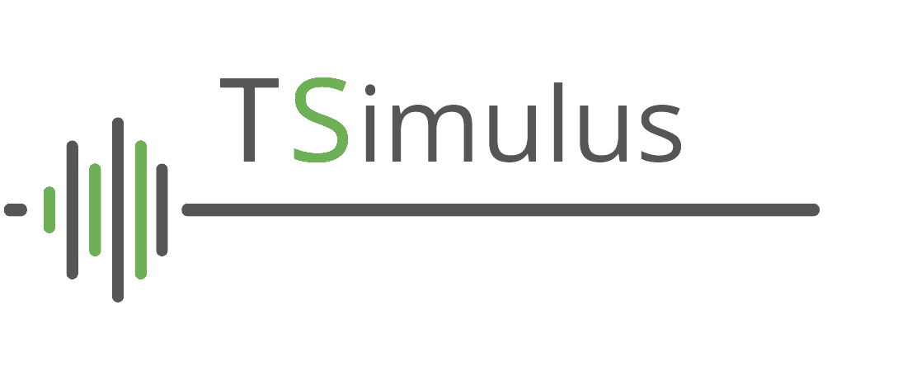
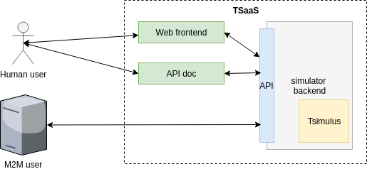

# TSimulus As A Service

 [](https://opensource.org/licenses/Apache-2.0)
[](https://app.fossa.io/projects/git%2Bgithub.com%2Fcetic%2Ftsimulus-saas?ref=badge_shield)

<p align="center" style="width: 50%; height: 200px;">
  <a href="https://tsimulus.readthedocs.io"></a>
</p>

## Goal

This project contains the high level documentation for the TSimulus SaaS project.
The aim of this work is to provide a self service that showcases TSimulus capabilities.

The project aims at building a REST API in front of the [TSimulus](https://github.com/cetic/TSimulus) framework, and a set of configurable websocket routes to consume the Tsimulus stream.

The project is strucured as a sbt multiproject, each part are runnable as standalone and the top level project coordinates a complete deployment and coordination of each parts.
In the following it is assumed that sbt is installed in your system.

## Sub-Projects
### Tsimulus backend

The backend implements the core logic for the stream handling.
It includes
 - wrapping the [TSimulus](https://github.com/cetic/TSimulus) for generating streams,
 - exposing a configuration and control REST API,
 - exposing websocket routes fed by outputs of the generator
 - handling the timing of data injection into the websockets.
 - processing templates for custom rendering of the generated data.

### 0. Getting started

#### 0.1. Prerequisites

Install sbt on your machine.

OR

Install [Vagrant](https://www.vagrantup.com/) and [Virtualbox](https://www.virtualbox.org/)

### 0.2. Local development

Clone this repository

```
git clone git@git.cetic.be:TSimulus/tsimulus-saas.git
```

In order to run the backend server, log into the project directory and run
````sh
sbt run
````
or from the root project, run
````sh
sbt backend/run
````

#### 0.2.1. Local development with [Vagrant](https://www.vagrantup.com/)

Launch the VM and ssh into it: (Vagrant will install sbt and docker on the VM)

```bash
vagrant up
vagrant ssh
```

Go into your shared `/vagrant` folder.

Then, run each line in a new terminal.

````
sbt backend/run
````

The `/vagrant` folder in the VM is shared with the folder where the `Vagrantfile` is on the host computer.

### 0.3. Local development environment with [Minikube](https://github.com/kubernetes/minikube)

#### 0.3.1. Prerequisites

* a virtualisation solution (for example [VirtualBox](https://www.virtualbox.org/wiki/Downloads) or KVM)
* [Kubectl](https://kubernetes.io/docs/tasks/tools/install-kubectl/), the Kubernetes CLI
* [Minikube](https://github.com/kubernetes/minikube/releases), a local Kubernetes cluster
* the [Helm client](https://helm.sh/docs/using_helm/#installing-helm)

#### 0.3.2. Local development/deployment

Start Minikube:

```
minikube start
```

To get the Kubernetes dashboard, type:

```bash
minikube dashboard
```


Launch the Helm script, this will deploy all the TSimulus-saas services (TSimulus microservice and Swagger UI) on the Minikube cluster (and may take some time).

```
# init helm
helm init --history-max 200 --upgrade
# add helm repos
helm repo add cetic https://cetic.github.io/helm-charts/
helm repo update
# install/upgrade tsaas
helm upgrade --install tsaas cetic/tsaas
# install/upgrade swaggerui
helm upgrade --install swaggerui cetic/swaggerui -f ./helm/swaggerui/values.yaml --set swaggerui.server.url=$(minikube service tsaas --url)
```

To access the different services, type

```
minikube service list
```

You should now be able to access to the swaggerui:


To delete the tsaas stack, type:   

```
helm delete --purge tsaas
helm delete --purge swaggerui
```         

### 0.4. Creating a websocket route

The websockets are exposed at the following URL:
```
ws://your.domain.be/socket/<UUID>
```
where <UUID> is a UUID.

The websocket handlers are built on the fly, when one of the two following condition is met:

  - A user connects to a websocket route:
  the server will create a stream with the uuid provided in the socket route.
  - A user posts a configuration:
    - Letting the server define a socket id
    - choosing socket id. In this case, successive posts will update the configuration.

The configuration routes provide a CRUD api to manage the stream configurations,
the control API exposes a set of action to manage the stream consuption.
These APIs are documented in the next subproject, exposing a complete Open Api Specification and an API explorer.

### 0.5. Stream configuration

A stream configuration consists in
  - A Tsimulus configuration
  - A consumption speed
  - A template
  - A type variable, set to "tsimulus" for tsimulus streams.

The stream configuation is to be sent in a json object to the stream configuration api:
```json
{
  "configuration": ...,
  "template": ...,
  "speed": ...,
  "type": "tsimulus"
}
```

### 0.6. Tsimulus configuration
Please refer to the official [Tsimulus documentation](https://tsimulus.readthedocs.io/en/latest/) for proper formatting.    

#### 0.6.1. Template

The template object includes has the schema:
````json
{
  "template": "string",
  "timeVariable": "string",
  "nameVariable": "string",
  "valueVariavle": "string"
}
````
The template string is processed by the [Apache FreeMarker](http://www.freemarker.org) engine.
We refer the user to the official documentation.

We additionally provide 3 custom functions in the template :
  - b64("little"|"big", number | list of numbers):
  This function converts each numbers to 32 bits floats and converts the resulting byte array to base 64, using **little** or **big** endianness.   
  - replicate(n, x): converts the value to a list of size n with the same value x.
  - noise(?std, x): adds random noise to x. For numeric values of x, gaussian noise is added, with a null expectation value and a standrad deviation given by std.

The timeVariable, nameVariable and valueVariable variables represents respectively the names of the time, name and value variables in the template.   


#### 0.6.2. Speed
The speed parameter can be a string or a number.
Each elements of a tsimulus stream comes with a timestamp and a value.
The stream can be consumed in three different ways:
  - realtime:
  The value is pushed in the websocket when the present datetime given by the server corresponds to the generated timestamp.    
  - Speed factor:
  The present datetime is ignored, only the time interval for the next element is taken into consideration.
  In this mode, the first element of the stream is emitted when the stream is started. The next element is emitted after a delay given by

  ```
  Delay = (t_1-t_0)/speed_factor
  ```
  - Infinite speed: The stream is consumed at once.  

The speed parameter should be configured as
````json
{"speed": "realtime"}
````
for the realtime mode,

````json
{"speed": "number"}
````
for the speed factor mode and
````json
{"speed": "inf"}
````
for the infinite speed mode.

### 0.7. API Explorer

This subproject exposes a Swagger UI is exposed .
The UI documents and allows to test the Configuration and control API described in the previous section.

#### 0.7.1 Getting Started
???

## Tsaas - Frontend

To be done

## 1. Functional specifications

### 1.1. TSimulus as a service

Definition of TSimulus from the documentation: https://tsimulus.readthedocs.io/en/latest/

TSimulus is a toolkit for generating random, yet realistic, time series. In this project, a time series is nothing but a orderly sequence of points in times, each of them being associated to at most a value. Time series are used in a wide variety of areas, including finance, weather forecasting, and signal processing.

While random-number generators can easily be used for producing sequences of unrelated (or, at least, hardly predictable) numbers, generating sequences of numbers that seem to respect some obvious patterns is also interesting in many circumstances, including the simulation of data acquisition in the aforementioned areas.

In order to make realistic time series, a convincing noise must generally be added to some specified patterns. In addition, the values of a time series may be related to those of an other time series.

The TSimulus project provides tools for specifying the shape of a time series (general patterns, cycles, importance of the added noise, etc.) and for converting this specification into time series values.

## 2. Technical specifications

Diagram sources are "here":https://drive.google.com/file/d/1rnZyI9u_A6-WpI8hoYdyxOqa6jFwWeNK/view?usp=sharing (draw.io format)

### 2.1. Logical view



#### Services

* **tsimulus-backend**: this service uses the TSimulus library to generate timeseries.
* **web frontend** provides a web interface to query the service and display the results to humans.
* **API** serves the backend service to programmatic clients and the web frontend.
* **api doc** provides
  * documentation for the API (endpoints, examples, errors, ...).
  * a console to test the API.
  * autogenerated API clients in various languages.

#### Actors

* Human user: uses the website to try the service, and views the api documentation.
* M2M user: external service has automated API usage.

### 2.2. Implementation view


* **web frontend**: Play Scala app to display the result.
* **API doc**: doc/console/clients website auto generated from Swagger file.
* **TSimulus backend + API server**: Akka actor + Akka cluster.

### 2.3. Deployment view


Developers use local Virtualbox+Vagrant virtual machine.

For now, the service is pushed to OpenShift with Gitlab CI.

### 2.4. Devops

#### 2.4.1. Development workflow

If using git: simplified version of [Git Flow](http://nvie.com/posts/a-successful-git-branching-model/) with mostly only `master`, `develop` and `feature` branches.

* new work is done on feature branches: e.g. the branch `feature/ns4b4ckd00r` will contain new developments intended to improve the security of the service
* once a feature is ready to be integrated in the `development` environment, it is merged into the `develop` branch.
* each merge of features into `develop` branch triggers:
  * build and publish artefacts.
  * deployment to the `development` environment: previous Docker containers are destroyed and recreated on OpenShift with the new version of the service contained in the `develop` branch.
  * various tests
* once the new version has been successfully deployed to the `development` environment and all tests are green, merge branch `develop` to branch `master` to trigger deployment to `production` environment (and run more tests)

#### 2.4.2. Automation

* server provisioning (creation of VM's and software installation): [Ansible](https://www.ansible.com)
* local dev environment: Vagrant+Virtualbox using the Ansible provisioning script
* Old Sample for Gitlab CI orchestrates the workflow. See the "gitlab-ci" file: https://git.cetic.be/TSimulus/tsimulus-cluster/blob/develop/.gitlab-ci.yml

#### 2.4.3. Swagger

Using Swagger-UI docker image: https://hub.docker.com/r/swaggerapi/swagger-ui/

#### 2.4.4. Testing

TBD

? unit testing
? API testing
? load testing
? ...

## Licence

TSimulus SaaS is release under the [Apache license](http://www.apache.org/licenses/) (version 2).

[](https://app.fossa.io/projects/git%2Bgithub.com%2Fcetic%2Ftsimulus-saas?ref=badge_large)
